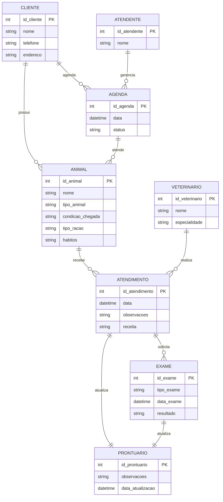

# REPOSITORIO ENGENHARIA DE SOFTWARE

- [REPOSITORIO ENGENHARIA DE SOFTWARE](#repositorio-engenharia-de-software)
- [1. Introdução](#1-introdução)
- [2. Descrição do negócio.](#2-descrição-do-negócio)
- [3. Visão geral do sistema](#3-visão-geral-do-sistema)
- [4. Diagrama ER](#4-diagrama-er)
- [5. Diagrama de classe](#5-diagrama-de-classe)
- [6. Casos de uso](#6-casos-de-uso)
  - [6.1 Histórias de Usuário](#61-histórias-de-usuário)
- [7. Diagrama de componente](#7-diagrama-de-componente)
- [8. Diagrama de implantação](#8-diagrama-de-implantação)
- [9. Protótipo de telas](#9-protótipo-de-telas)
- [10 Diagrama de navegação de telas](#10-diagrama-de-navegação-de-telas)
- [11. Pilha tecnológica](#11-pilha-tecnológica)
- [12. Requisitos do sistema](#12-requisitos-do-sistema)
- [13. Considerações sobre segurança](#13-considerações-sobre-segurança)
- [14. manutenção e instalação](#14-manutenção-e-instalação)
- [15. Glossário](#15-glossário)

# 1. Introdução

O projeto a seguir apresenta um sistema desenvolvido para um pet shop. A empresa é considerada  micro e iniciou as atividades recentemente. Ao possuir serviços exclusivos, os sistemas presentes no mercado não se enquadram, desta forma, os proprietários decidiram desenvolver uma solução própria. Esta solução é detalhada.

# 2. Descrição do negócio.

Descrição do cenário onde o sistema deverá funcionar:

| ID  | Requisito                                                                                  |
| --- | -------------------------------------------------------------------------------------------|
| 1   | A clínica veterinária atende apenas os animais: gatos e cachorros.                         |
| 2   | Os clientes devem fazer um cadastro de si e dos animais.                                   |
| 3   | Os clientes devem informar as condições nas quais os animais chegam.                       |
| 4   | Os clientes devem informar o tipo de ração que o animal come.                              |
| 5   | O cliente deve informar hábitos do animal.                                                 |
| 6   | Para cada animal é possível que mais de um veterinário o atenda.                           |
| 7   | Os animais podem chegar e serem atendidos de acordo com uma agenda do dia.                 |
| 8   | Cada animal atendido receberá uma ficha e um prontuário.                                   |
| 9   | Outros donos podem querer marcar horários de atendimento futuro.                           |
| 10  | O atendimento gera uma receita para o animal.                                              |
| 11  | Quando um cliente chega na clínica veterinária ele é atendido por um atendente.            |
| 12  | O atendente deve verificar se existe agenda disponível com um veterinário.                 |
| 13  | O atendente deve colocar o cliente e seu animal na fila de espera, se for o caso.          |
| 14  | O atendente deve levar o cliente e o animal até o veterinário.                             |
| 15  | O veterinário deve realizar uma entrevista com o dono do animal.                           |
| 16  | O resultado da entrevista deve ir para um formulário.                                      |
| 17  | O veterinário deverá examinar o animal e anotar em prontuário (ficha) suas observações.    |
| 18  | Dependendo da situação do animal, este receberá uma receita.                               |
| 19  | O veterinário pode solicitar exames complementares para o animal.                          |
| 20  | O cliente será informado do prazo para entrega dos resultados dos exames.                  |
| 21  | O prontuário do animal será atualizado com os resultados dos exames realizados.            |
| 22  | O cliente deve ser notificado quando o prontuário ou receita do animal for atualizado.      |
| 23  | Caso necessário, o veterinário pode agendar retornos para acompanhamento do tratamento.     |
| 24  | A clínica deve manter um histórico de atendimentos e receitas emitidas para cada animal.    |
| 25  | Os donos devem receber lembretes de vacinação e controle de saúde periódicos para os animais.|

# 3. Visão geral do sistema

# 4. Diagrama ER

# 5. Diagrama de classe

# 6. Casos de uso

## 6.1 Histórias de Usuário

# 7. Diagrama de componente  

# 8. Diagrama de implantação

# 9. Protótipo de telas

# 10 Diagrama de navegação de telas

# 11. Pilha tecnológica

# 12. Requisitos do sistema

# 13. Considerações sobre segurança

# 14. manutenção e instalação

# 15. Glossário

