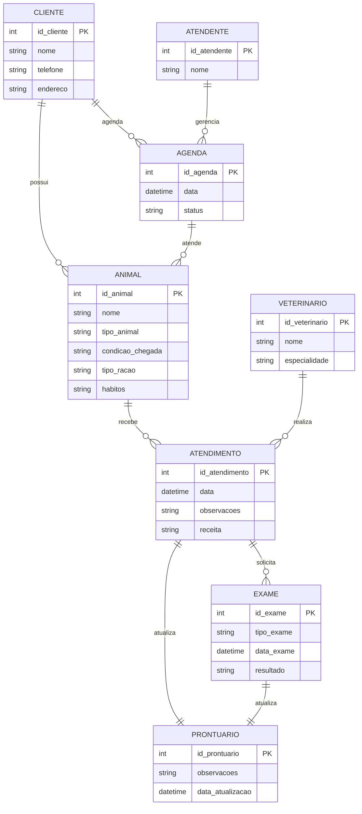
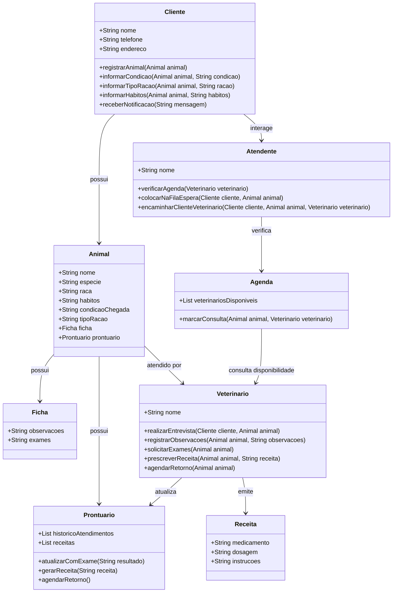
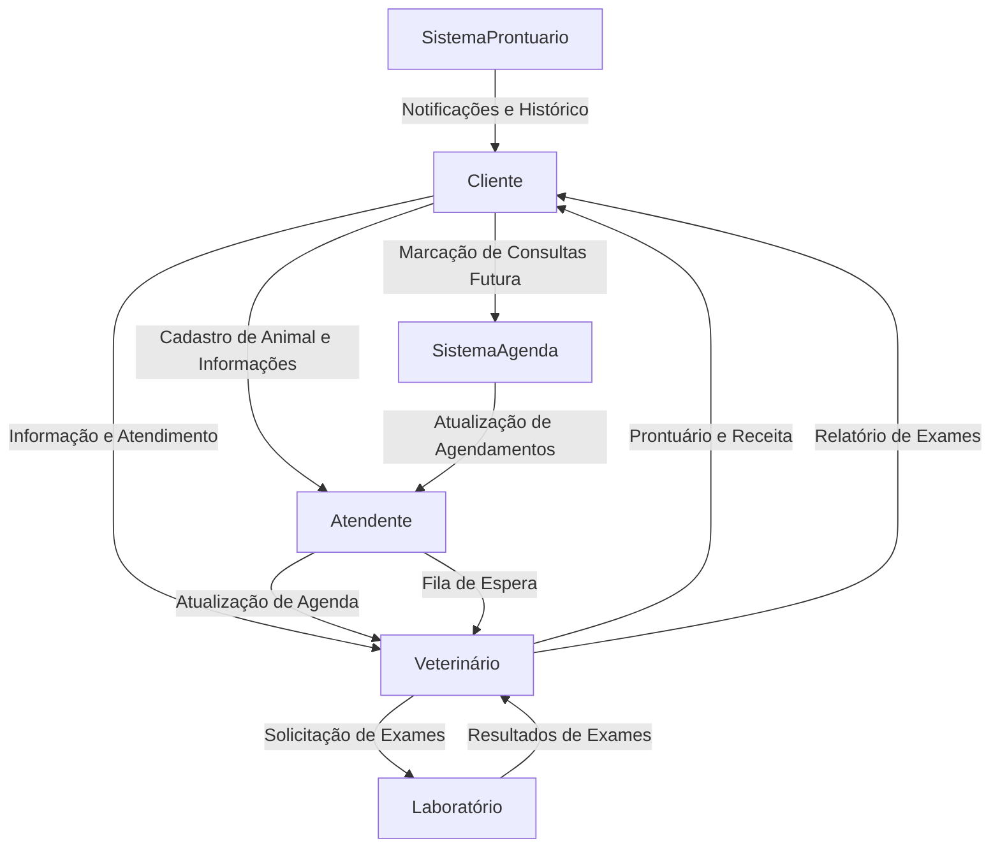
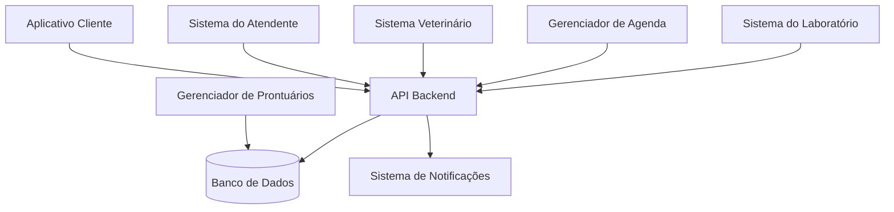
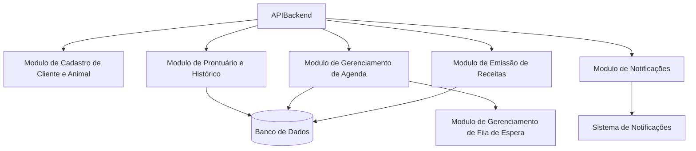
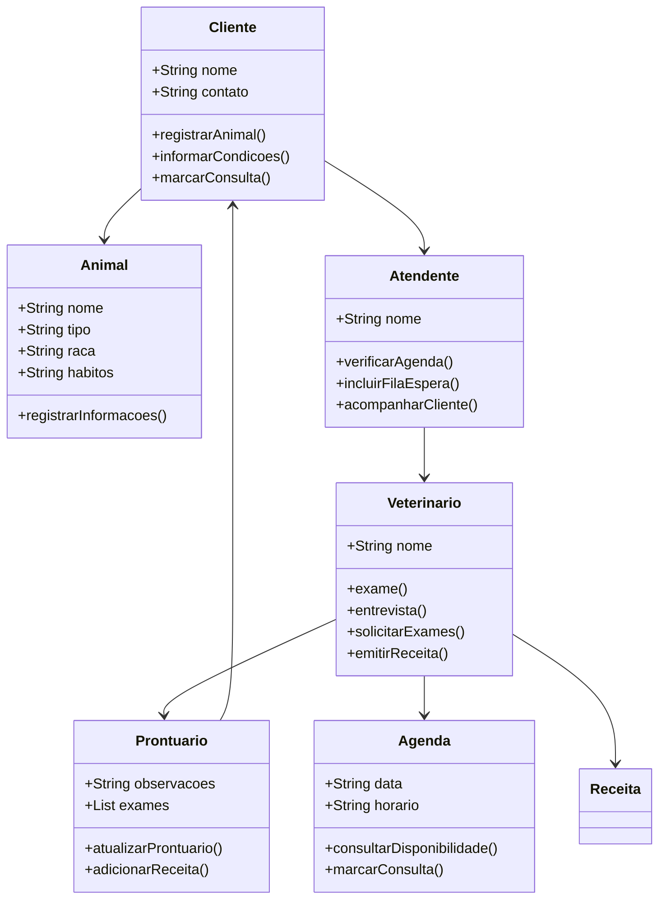
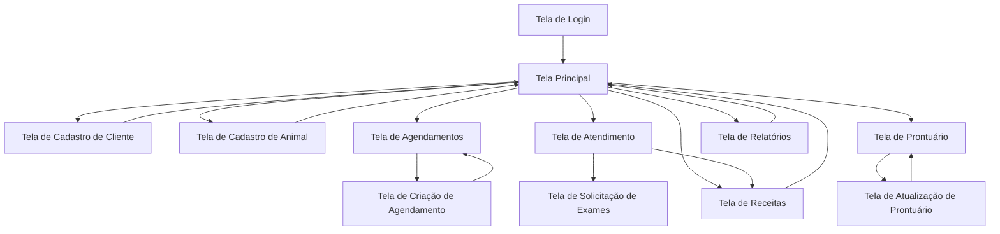

# REPOSITORIO ENGENHARIA DE SOFTWARE


- [REPOSITORIO ENGENHARIA DE SOFTWARE](#repositorio-engenharia-de-software)
- [1. Introdução](#1-introdução)
- [2. Descrição do negócio.](#2-descrição-do-negócio)
  - [2.1 Requisitos](#21-requisitos)
    - [Requisitos funcionais e não funcionais](#requisitos-funcionais-e-não-funcionais)
- [3. Visão geral do sistema](#3-visão-geral-do-sistema)
  - [3.1 Arquitetura](#31-arquitetura)
  - [3.2 Funcionalidades Principais](#32-funcionalidades-principais)
  - [3.3 Tecnologias Utilizadas](#33-tecnologias-utilizadas)
  - [3.4 Integrações](#34-integrações)
  - [3.5 Segurança](#35-segurança)
- [4. Diagrama ER](#4-diagrama-er)
- [5. Diagrama de classe](#5-diagrama-de-classe)
- [6. Casos de uso](#6-casos-de-uso)
  - [6.1 Histórias de Usuário](#61-histórias-de-usuário)
    - [História de Usuário 1: Cadastro de Cliente e Animais](#história-de-usuário-1-cadastro-de-cliente-e-animais)
    - [História de Usuário 2: Informar Condições e Hábitos do Animal](#história-de-usuário-2-informar-condições-e-hábitos-do-animal)
    - [História de Usuário 3: Atendimento por Múltiplos Veterinários](#história-de-usuário-3-atendimento-por-múltiplos-veterinários)
    - [História de Usuário 4: Agendamento de Consultas Futuras](#história-de-usuário-4-agendamento-de-consultas-futuras)
    - [História de Usuário 5: Ficha e Prontuário do Animal](#história-de-usuário-5-ficha-e-prontuário-do-animal)
    - [História de Usuário 6: Atendimento e Fila de Espera](#história-de-usuário-6-atendimento-e-fila-de-espera)
    - [História de Usuário 7: Entrevista e Exame do Animal](#história-de-usuário-7-entrevista-e-exame-do-animal)
    - [História de Usuário 8: Receitar Medicamentos e Solicitar Exames](#história-de-usuário-8-receitar-medicamentos-e-solicitar-exames)
    - [História de Usuário 9: Notificar Clientes Sobre Atualizações](#história-de-usuário-9-notificar-clientes-sobre-atualizações)
    - [História de Usuário 10: Agendar Retorno para Acompanhamento](#história-de-usuário-10-agendar-retorno-para-acompanhamento)
    - [História de Usuário 11: Histórico de Atendimentos e Receitas](#história-de-usuário-11-histórico-de-atendimentos-e-receitas)
    - [História de Usuário 12: Lembretes de Vacinação e Saúde](#história-de-usuário-12-lembretes-de-vacinação-e-saúde)
- [7. Diagrama de componente](#7-diagrama-de-componente)
- [8. Diagrama de implantação](#8-diagrama-de-implantação)
- [9. Diagrama C4](#9-diagrama-c4)
  - [9.1 diagrama de contexto](#91-diagrama-de-contexto)
  - [9.2 diagrama de contêiner](#92-diagrama-de-contêiner)
  - [9.3 diagrama de componente](#93-diagrama-de-componente)
  - [9.4 diagrama de código](#94-diagrama-de-código)
- [10. Protótipo de telas](#10-protótipo-de-telas)
  - [10.1 Telas](#101-telas)
    - [Login](#login)
    - [Tela principal](#tela-principal)
    - [Cadastro](#cadastro)
    - [Graficos](#graficos)
    - [Dashboard](#dashboard)
- [11. Diagrama de Navegação de Telas](#11-diagrama-de-navegação-de-telas)
- [12. Pilha tecnológica](#12-pilha-tecnológica)
- [13. Requisitos do Sistema](#13-requisitos-do-sistema)
  - [13.1 Requisitos de Hardware](#131-requisitos-de-hardware)
  - [13.2 Requisitos de Software](#132-requisitos-de-software)
- [14. Considerações sobre Segurança](#14-considerações-sobre-segurança)
  - [14.1 Criptografia](#141-criptografia)
  - [14.2 Controle de Acesso](#142-controle-de-acesso)
  - [14.3 Backup e Recuperação](#143-backup-e-recuperação)
  - [14.4 Conformidade com LGPD](#144-conformidade-com-lgpd)
  - [14.5 Monitoramento e Resposta](#145-monitoramento-e-resposta)
- [15. Manutenção e Instalação](#15-manutenção-e-instalação)
  - [15.1 Processo de Instalação](#151-processo-de-instalação)
  - [15.2 Manutenção](#152-manutenção)
- [16. Glossário](#16-glossário)
- [17. Script SQL](#17-script-sql)
  - [17.1 Comando create data base](#171-comando-create-data-base)
  - [17.2 Comando INSERT](#172-comando-insert)


# 1. Introdução

O projeto a seguir apresenta um sistema desenvolvido para um pet shop. A empresa é considerada  micro e iniciou as atividades recentemente. Ao possuir serviços exclusivos, os sistemas presentes no mercado não se enquadram, desta forma, os proprietários decidiram desenvolver uma solução própria. Esta solução é detalhada.

# 2. Descrição do negócio.

Descrição do cenário onde o sistema deverá funcionar:

| ID  | Requisito                                                                                  |
| --- | -------------------------------------------------------------------------------------------|
| 1   | A clínica veterinária atende apenas os animais: gatos e cachorros.                         |
| 2   | Os clientes devem fazer um cadastro de si e dos animais.                                   |
| 3   | Os clientes devem informar as condições nas quais os animais chegam.                       |
| 4   | Os clientes devem informar o tipo de ração que o animal come.                              |
| 5   | O cliente deve informar hábitos do animal.                                                 |
| 6   | Para cada animal é possível que mais de um veterinário o atenda.                           |
| 7   | Os animais podem chegar e serem atendidos de acordo com uma agenda do dia.                 |
| 8   | Cada animal atendido receberá uma ficha e um prontuário.                                   |
| 9   | Outros donos podem querer marcar horários de atendimento futuro.                           |
| 10  | O atendimento gera uma receita para o animal.                                              |
| 11  | Quando um cliente chega na clínica veterinária ele é atendido por um atendente.            |
| 12  | O atendente deve verificar se existe agenda disponível com um veterinário.                 |
| 13  | O atendente deve colocar o cliente e seu animal na fila de espera, se for o caso.          |
| 14  | O atendente deve levar o cliente e o animal até o veterinário.                             |
| 15  | O veterinário deve realizar uma entrevista com o dono do animal.                           |
| 16  | O resultado da entrevista deve ir para um formulário.                                      |
| 17  | O veterinário deverá examinar o animal e anotar em prontuário (ficha) suas observações.    |
| 18  | Dependendo da situação do animal, este receberá uma receita.                               |
| 19  | O veterinário pode solicitar exames complementares para o animal.                          |
| 20  | O cliente será informado do prazo para entrega dos resultados dos exames.                  |
| 21  | O prontuário do animal será atualizado com os resultados dos exames realizados.            |
| 22  | O cliente deve ser notificado quando o prontuário ou receita do animal for atualizado.      |
| 23  | Caso necessário, o veterinário pode agendar retornos para acompanhamento do tratamento.     |
| 24  | A clínica deve manter um histórico de atendimentos e receitas emitidas para cada animal.    |
| 25  | Os donos devem receber lembretes de vacinação e controle de saúde periódicos para os animais.|

## 2.1 Requisitos

### Requisitos funcionais e não funcionais

| **Requisitos Funcionais** | **Descrição** |
|----------------------------|------------------------------------------------------------|
| RF01 | A clínica deve atender apenas gatos e cachorros. |
| RF02 | Os clientes devem poder fazer o cadastro de si e dos animais. |
| RF03 | Os clientes devem informar as condições de chegada dos animais. |
| RF04 | Os clientes devem informar o tipo de ração que o animal consome. |
| RF05 | Os clientes devem informar os hábitos dos animais. |
| RF06 | Mais de um veterinário pode atender o mesmo animal. |
| RF07 | Os animais devem ser atendidos de acordo com uma agenda diária. |
| RF08 | Cada animal atendido deve receber uma ficha e um prontuário. |
| RF09 | Os donos podem marcar horários de atendimento futuro. |
| RF10 | O atendimento deve gerar uma receita para o animal. |
| RF11 | O cliente deve ser atendido por um atendente ao chegar na clínica. |
| RF12 | O atendente deve verificar a disponibilidade de agenda com o veterinário. |
| RF13 | O atendente deve colocar o cliente e seu animal na fila de espera, se necessário. |
| RF14 | O atendente deve levar o cliente e o animal ao veterinário. |
| RF15 | O veterinário deve realizar uma entrevista com o dono do animal. |
| RF16 | O resultado da entrevista deve ser registrado em um formulário. |
| RF17 | O veterinário deve examinar o animal e anotar as observações no prontuário. |
| RF18 | O animal deve receber uma receita, dependendo da situação. |
| RF19 | O veterinário pode solicitar exames complementares. |
| RF20 | O cliente deve ser informado sobre o prazo de entrega dos exames. |
| RF21 | O prontuário do animal deve ser atualizado com os resultados dos exames. |
| RF22 | O cliente deve ser notificado sobre atualizações no prontuário ou receita. |
| RF23 | O veterinário pode agendar retornos para acompanhamento do tratamento. |
| RF24 | A clínica deve manter um histórico de atendimentos e receitas para cada animal. |
| RF25 | Os donos devem receber lembretes de vacinação e controle de saúde. |

| **Requisitos Não Funcionais** | **Descrição** |
|--------------------------------|------------------------------------------------------------|
| RNF01 | O sistema deve garantir a segurança dos dados dos clientes e dos animais. |
| RNF02 | O sistema deve ser acessível por meio de dispositivos móveis e desktops. |
| RNF03 | A interface deve ser intuitiva e de fácil uso para clientes e funcionários. |
| RNF04 | O tempo de resposta para consultas de dados deve ser inferior a 2 segundos. |
| RNF05 | O sistema deve suportar múltiplos usuários simultâneos. |
| RNF06 | As notificações aos clientes devem ser enviadas por e-mail ou SMS. |
| RNF07 | O sistema deve estar disponível 24/7 com 99,9% de uptime. |
| RNF08 | Os dados devem ser armazenados de forma a garantir a integridade e backup diário. |
| RNF09 | O sistema deve estar em conformidade com a legislação de proteção de dados. |
| RNF10 | O sistema deve permitir escalabilidade para suportar o crescimento da clínica. |


# 3. Visão geral do sistema

O sistema é composto por diversos módulos interconectados que colaboram para fornecer uma experiência integrada ao usuário. A seguir, apresentamos os principais componentes:

## 3.1 Arquitetura

A arquitetura do sistema é baseada em uma estrutura modular, permitindo escalabilidade e manutenção simplificada. Os principais módulos incluem:

- **Frontend**: Interface do usuário desenvolvida com tecnologias web modernas, proporcionando uma experiência interativa e responsiva.
- **Backend**: Servidor responsável pelo processamento de lógica de negócios e gerenciamento de dados, implementado em uma linguagem de programação robusta.
- **Banco de Dados**: Sistema de gerenciamento de banco de dados relacional que armazena informações essenciais de forma estruturada.

## 3.2 Funcionalidades Principais

O sistema oferece as seguintes funcionalidades:

- **Autenticação de Usuários**: Permite que os usuários se registrem e façam login de forma segura.
- **Gerenciamento de Conteúdo**: Ferramentas para criação, edição e exclusão de conteúdo, facilitando a administração de informações.
- **Relatórios e Análises**: Geração de relatórios detalhados e análises de dados para auxiliar na tomada de decisões.

## 3.3 Tecnologias Utilizadas

As principais tecnologias empregadas no desenvolvimento do sistema são:

- **Linguagens de Programação**: Utilização de linguagens como JavaScript para o frontend e Python para o backend.
- **Frameworks**: Implementação de frameworks como React para o frontend e Django para o backend, acelerando o desenvolvimento.
- **Banco de Dados**: Uso do PostgreSQL como sistema de gerenciamento de banco de dados, garantindo confiabilidade e desempenho.

## 3.4 Integrações

O sistema integra-se com diversas APIs e serviços externos para ampliar suas funcionalidades, incluindo:

- **Serviços de Pagamento**: Integração com gateways de pagamento para processar transações financeiras.
- **Redes Sociais**: Conexão com plataformas de redes sociais para compartilhamento e autenticação.
- **Serviços de E-mail**: Utilização de serviços de e-mail para notificações e comunicação com os usuários.

## 3.5 Segurança

Medidas de segurança implementadas no sistema:

- **Criptografia de Dados**: Proteção de dados sensíveis por meio de criptografia avançada.
- **Controle de Acesso**: Definição de permissões e níveis de acesso para diferentes tipos de usuários.
- **Monitoramento**: Implementação de ferramentas de monitoramento para detectar e responder a atividades suspeitas.


# 4. Diagrama ER



# 5. Diagrama de classe



# 6. Casos de uso


## 6.1 Histórias de Usuário
---

### História de Usuário 1: Cadastro de Cliente e Animais
**Como** um cliente da clínica veterinária,  
**Eu quero** cadastrar tanto as minhas informações pessoais quanto as dos meus animais (gatos ou cachorros),  
**Para que** a clínica possa me identificar e registrar os animais que trago para atendimento.

---

### História de Usuário 2: Informar Condições e Hábitos do Animal
**Como** um cliente,  
**Eu quero** informar as condições nas quais meu animal chegou à clínica, os tipos de ração que ele consome e seus hábitos,  
**Para que** o veterinário possa ter uma visão clara do estado geral do animal antes do atendimento.

---

### História de Usuário 3: Atendimento por Múltiplos Veterinários
**Como** um cliente,  
**Eu quero** que meu animal possa ser atendido por mais de um veterinário,  
**Para que** ele receba o cuidado necessário, mesmo quando o veterinário principal não estiver disponível.

---

### História de Usuário 4: Agendamento de Consultas Futuras
**Como** um cliente,  
**Eu quero** marcar um horário de atendimento futuro para meu animal,  
**Para que** eu possa planejar o cuidado veterinário sem depender de disponibilidade imediata.

---

### História de Usuário 5: Ficha e Prontuário do Animal
**Como** um veterinário,  
**Eu quero** registrar cada atendimento em uma ficha com o prontuário do animal,  
**Para que** todas as informações médicas sejam documentadas de forma organizada e acessível em futuros atendimentos.

---

### História de Usuário 6: Atendimento e Fila de Espera
**Como** um atendente,  
**Eu quero** verificar a agenda dos veterinários e, se necessário, colocar o cliente e seu animal na fila de espera,  
**Para que** possamos otimizar o fluxo de atendimento e garantir que todos sejam atendidos de forma eficiente.

---

### História de Usuário 7: Entrevista e Exame do Animal
**Como** um veterinário,  
**Eu quero** realizar uma entrevista com o dono do animal e, em seguida, examinar o animal,  
**Para que** eu possa anotar minhas observações no prontuário e ter uma base completa para a consulta.

---

### História de Usuário 8: Receitar Medicamentos e Solicitar Exames
**Como** um veterinário,  
**Eu quero** emitir receitas e solicitar exames complementares para o animal,  
**Para que** o tratamento adequado seja aplicado e o estado de saúde do animal seja verificado com precisão.

---

### História de Usuário 9: Notificar Clientes Sobre Atualizações
**Como** um cliente,  
**Eu quero** ser notificado sempre que o prontuário ou a receita do meu animal for atualizado,  
**Para que** eu fique informado sobre o progresso do tratamento ou resultados de exames.

---

### História de Usuário 10: Agendar Retorno para Acompanhamento
**Como** um veterinário,  
**Eu quero** agendar retornos para acompanhamento do tratamento dos animais,  
**Para que** eu possa monitorar a saúde do animal e ajustar o tratamento conforme necessário.

---

### História de Usuário 11: Histórico de Atendimentos e Receitas
**Como** o administrador da clínica,  
**Eu quero** manter um histórico completo de todos os atendimentos e receitas emitidas para cada animal,  
**Para que** possamos consultar o histórico médico em qualquer momento e garantir um atendimento contínuo.

---

### História de Usuário 12: Lembretes de Vacinação e Saúde
**Como** um cliente,  
**Eu quero** receber lembretes periódicos sobre vacinas e controle de saúde para meu animal,  
**Para que** eu possa garantir que ele esteja sempre com a saúde em dia.

---

# 7. Diagrama de componente  


# 8. Diagrama de implantação


# 9. Diagrama C4

## 9.1 diagrama de contexto


## 9.2 diagrama de contêiner



## 9.3 diagrama de componente



## 9.4 diagrama de código



# 10. Protótipo de telas

## 10.1 Telas

---

### Login


---

### Tela principal


---

### Cadastro


---

### Graficos


---

### Dashboard


---


# 11. Diagrama de Navegação de Telas

Abaixo está o diagrama de navegação das telas do sistema, representando o fluxo entre as diferentes interfaces:



# 12. Pilha tecnológica

```
graph TB

subgraph Frontend
    A1[React.js]
    A2[Redux]
    A3[Mobile App (React Native)]
    A4[Web Interface (Next.js)]
end

subgraph Backend
    B1[Node.js]
    B2[Express.js]
    B3[JWT Auth]
    B4[REST API]
    B5[GraphQL API]
end

subgraph Database
    C1[MySQL/PostgreSQL]
    C2[MongoDB]
    C3[Redis (Caching)]
    C4[Elasticsearch (Busca)]
end

subgraph Infraestrutura
    D1[Nginx]
    D2[Docker]
    D3[Load Balancer]
    D4[Cloud Hosting: AWS/GCP/Azure]
    D5[Kubernetes (Orquestração)]
end

subgraph Integrações
    E1[Payment Gateway (Stripe/PayPal)]
    E2[SMS API (Twilio)]
    E3[Email Service (SendGrid)]
    E4[Pet Health API (Veterinários)]
    E5[CRM Integration (Zoho, HubSpot)]
end

A3 --> B1
A4 --> B4
A1 --> B4
A1 --> B5
A2 --> A1

B1 --> B2
B2 --> B4
B4 --> C1
B4 --> C2
B5 --> C3
B5 --> C4

B1 --> D1
D1 --> D2
D2 --> D3
D3 --> D4
D2 --> D5

B4 --> E1
B4 --> E2
B4 --> E3
B5 --> E4
B5 --> E5

```

# 13. Requisitos do Sistema

O sistema desenvolvido para a clínica veterinária deve atender aos seguintes requisitos técnicos:

## 13.1 Requisitos de Hardware
- Servidor com:
  - Processador: Intel Xeon ou superior.
  - Memória RAM: 16 GB ou mais.
  - Armazenamento: 500 GB SSD ou superior.
  - Conexão de Rede: 1 Gbps.

- Estações de trabalho para funcionários:
  - Processador: Intel i5 ou equivalente.
  - Memória RAM: 8 GB ou mais.
  - Armazenamento: 256 GB SSD.
  - Resolução de Tela: Full HD (1920x1080).

## 13.2 Requisitos de Software
- **Sistema Operacional:** 
  - Servidor: Linux (Ubuntu Server 20.04 LTS ou superior).
  - Estações de trabalho: Windows 10 ou superior / Ubuntu Desktop.

- **Softwares necessários:**
  - Banco de dados: PostgreSQL 13 ou superior.
  - Backend: Node.js 16 ou superior.
  - Frontend: React 17 ou superior.
  - Navegadores compatíveis: Google Chrome, Mozilla Firefox.

- **Dependências:**
  - Docker e Docker Compose para containerização.
  - Serviços de backup automatizado.

---

# 14. Considerações sobre Segurança

A segurança do sistema foi priorizada com as seguintes medidas:

## 14.1 Criptografia
- Dados sensíveis (senhas, informações médicas) são armazenados com algoritmos de hash como **bcrypt**.
- Comunicação segura entre cliente e servidor via **HTTPS** com certificados SSL.

## 14.2 Controle de Acesso
- Autenticação por meio de **JWT (JSON Web Tokens)**.
- Níveis de permissão:
  - Administradores.
  - Veterinários.
  - Atendentes.
  - Clientes.

## 14.3 Backup e Recuperação
- Backups diários automatizados dos bancos de dados.
- Armazenamento redundante em servidores externos para recuperação de desastres.

## 14.4 Conformidade com LGPD
- Coleta de consentimento explícito para armazenamento de dados pessoais.
- Registro e auditoria de acessos aos dados.

## 14.5 Monitoramento e Resposta
- Logs centralizados para auditoria e análise de segurança.
- Ferramentas de detecção de intrusão (IDS) ativas.

---

# 15. Manutenção e Instalação

## 15.1 Processo de Instalação
1. **Configuração do Servidor:**
   - Instale o sistema operacional Linux.
   - Configure o ambiente com Docker e Docker Compose.
   
2. **Implementação do Sistema:**
   - Clone o repositório do projeto.
   - Configure variáveis de ambiente (ex.: conexões de banco de dados).
   - Execute o `docker-compose up` para iniciar os contêineres.

3. **Configuração Inicial:**
   - Crie os usuários iniciais (admin, veterinários, atendentes).
   - Configure as notificações (e-mail/SMS).

## 15.2 Manutenção
- **Atualizações:** 
  - Verifique semanalmente por atualizações do sistema no repositório.
  - Realize atualizações em ambiente de homologação antes de aplicar em produção.

- **Monitoramento:**
  - Utilize ferramentas como **Prometheus** e **Grafana** para monitorar desempenho.
  - Configure alertas para identificar falhas no sistema.

- **Limpeza de Dados:**
  - Realize auditorias trimestrais nos bancos de dados para remover registros desnecessários.

---

# 16. Glossário

- **Animal:** Refere-se aos pacientes (gatos e cachorros) atendidos pela clínica.
- **Cliente:** Proprietário de um ou mais animais, responsável pelo cadastro e informações.
- **Veterinário:** Profissional responsável pelos atendimentos clínicos e diagnósticos.
- **Atendente:** Funcionário que organiza agendamentos e auxilia no fluxo de atendimento.
- **Prontuário:** Registro médico contendo histórico, receitas e resultados de exames.
- **Receita:** Documento emitido pelo veterinário com a prescrição de medicamentos ou tratamentos.
- **Agenda:** Sistema de gerenciamento de horários e consultas na clínica.
- **LGPD:** Lei Geral de Proteção de Dados, legislação brasileira que regula o uso de dados pessoais.
- **JWT:** JSON Web Token, tecnologia usada para autenticação segura em sistemas web.
- **Backup:** Cópia de segurança dos dados armazenados no sistema.
- **Docker:** Plataforma para containerização de aplicações, permitindo maior eficiência e portabilidade.
- **HTTPS:** Protocolo para comunicação segura na internet, protegendo os dados transmitidos.


# 17. Script SQL

## 17.1 Comando create data base

```SQL
-- Tabela de Clientes
CREATE TABLE Cliente (
    id_cliente INT AUTO_INCREMENT PRIMARY KEY,
    nome VARCHAR(100) NOT NULL,
    telefone VARCHAR(20),
    endereco VARCHAR(200)
);

-- Tabela de Animais (gatos e cachorros)
CREATE TABLE Animal (
    id_animal INT AUTO_INCREMENT PRIMARY KEY,
    nome VARCHAR(50) NOT NULL,
    tipo_animal ENUM('gato', 'cachorro') NOT NULL,
    condicao_chegada VARCHAR(200),
    tipo_racao VARCHAR(100),
    habitos TEXT,
    id_cliente INT,
    FOREIGN KEY (id_cliente) REFERENCES Cliente(id_cliente) ON DELETE CASCADE
);

-- Tabela de Veterinários
CREATE TABLE Veterinario (
    id_veterinario INT AUTO_INCREMENT PRIMARY KEY,
    nome VARCHAR(100) NOT NULL,
    especialidade VARCHAR(100)
);

-- Tabela de Atendentes
CREATE TABLE Atendente (
    id_atendente INT AUTO_INCREMENT PRIMARY KEY,
    nome VARCHAR(100) NOT NULL
);

-- Tabela de Agenda
CREATE TABLE Agenda (
    id_agenda INT AUTO_INCREMENT PRIMARY KEY,
    data_hora DATETIME NOT NULL,
    status ENUM('agendado', 'concluido', 'cancelado') DEFAULT 'agendado',
    id_cliente INT,
    id_animal INT,
    id_atendente INT,
    id_veterinario INT,
    FOREIGN KEY (id_cliente) REFERENCES Cliente(id_cliente) ON DELETE CASCADE,
    FOREIGN KEY (id_animal) REFERENCES Animal(id_animal) ON DELETE CASCADE,
    FOREIGN KEY (id_atendente) REFERENCES Atendente(id_atendente),
    FOREIGN KEY (id_veterinario) REFERENCES Veterinario(id_veterinario)
);

-- Tabela de Atendimentos
CREATE TABLE Atendimento (
    id_atendimento INT AUTO_INCREMENT PRIMARY KEY,
    data DATETIME NOT NULL,
    observacoes TEXT,
    receita TEXT,
    id_animal INT,
    id_veterinario INT,
    FOREIGN KEY (id_animal) REFERENCES Animal(id_animal) ON DELETE CASCADE,
    FOREIGN KEY (id_veterinario) REFERENCES Veterinario(id_veterinario) ON DELETE CASCADE
);

-- Tabela de Prontuários
CREATE TABLE Prontuario (
    id_prontuario INT AUTO_INCREMENT PRIMARY KEY,
    observacoes TEXT,
    data_atualizacao DATETIME,
    id_animal INT,
    FOREIGN KEY (id_animal) REFERENCES Animal(id_animal) ON DELETE CASCADE
);

-- Tabela de Exames
CREATE TABLE Exame (
    id_exame INT AUTO_INCREMENT PRIMARY KEY,
    tipo_exame VARCHAR(100),
    data_exame DATETIME,
    resultado TEXT,
    id_atendimento INT,
    FOREIGN KEY (id_atendimento) REFERENCES Atendimento(id_atendimento) ON DELETE CASCADE
);

-- Tabela de Notificações para Clientes (lembretes de vacinação, controle de saúde)
CREATE TABLE Notificacao (
    id_notificacao INT AUTO_INCREMENT PRIMARY KEY,
    mensagem TEXT,
    data_envio DATETIME,
    id_cliente INT,
    id_animal INT,
    FOREIGN KEY (id_cliente) REFERENCES Cliente(id_cliente) ON DELETE CASCADE,
    FOREIGN KEY (id_animal) REFERENCES Animal(id_animal) ON DELETE CASCADE
);

-- Tabela para associar veterinários com animais (um animal pode ser atendido por vários veterinários)
CREATE TABLE Veterinario_Atendimento (
    id_veterinario INT,
    id_animal INT,
    PRIMARY KEY (id_veterinario, id_animal),
    FOREIGN KEY (id_veterinario) REFERENCES Veterinario(id_veterinario) ON DELETE CASCADE,
    FOREIGN KEY (id_animal) REFERENCES Animal(id_animal) ON DELETE CASCADE
);

-- Tabela de formulários da entrevista do veterinário com o dono do animal
CREATE TABLE FormularioEntrevista (
    id_formulario INT AUTO_INCREMENT PRIMARY KEY,
    perguntas TEXT,
    respostas TEXT,
    id_atendimento INT,
    FOREIGN KEY (id_atendimento) REFERENCES Atendimento(id_atendimento) ON DELETE CASCADE
);

```


## 17.2 Comando INSERT 

```SQL
-- Inserindo dados na tabela Cliente
INSERT INTO Cliente (nome, telefone, endereco) VALUES
('Maria Silva', '11987654321', 'Rua das Flores, 123'),
('João Souza', '11998765432', 'Avenida Brasil, 456'),
('Ana Pereira', '11999887766', 'Rua do Sol, 789');

-- Inserindo dados na tabela Animal
INSERT INTO Animal (nome, tipo_animal, condicao_chegada, tipo_racao, habitos, id_cliente) VALUES
('Rex', 'cachorro', 'Resgatado da rua, em boa condição', 'Ração premium', 'Muito ativo, gosta de correr', 1),
('Mimi', 'gato', 'Chegou com ferimento na pata', 'Ração para gatos adultos', 'Calma, gosta de dormir', 2),
('Fofinho', 'cachorro', 'Problemas digestivos', 'Ração para cães sensíveis', 'Amoroso e dócil', 3);

-- Inserindo dados na tabela Veterinario
INSERT INTO Veterinario (nome, especialidade) VALUES
('Dr. Carlos Mendes', 'Cirurgia veterinária'),
('Dra. Fernanda Costa', 'Dermatologia animal'),
('Dr. Pedro Lima', 'Clinica Geral');

-- Inserindo dados na tabela Atendente
INSERT INTO Atendente (nome) VALUES
('Julia Santos'),
('Paulo Almeida'),
('Vanessa Oliveira');

-- Inserindo dados na tabela Agenda
INSERT INTO Agenda (data_hora, status, id_cliente, id_animal, id_atendente, id_veterinario) VALUES
('2023-09-01 10:00:00', 'agendado', 1, 1, 1, 1),
('2023-09-02 11:30:00', 'concluido', 2, 2, 2, 2),
('2023-09-03 14:00:00', 'cancelado', 3, 3, 3, 3);

-- Inserindo dados na tabela Atendimento
INSERT INTO Atendimento (data, observacoes, receita, id_animal, id_veterinario) VALUES
('2023-09-01 10:00:00', 'Animal apresentou sintomas de febre', 'Antibiótico por 5 dias', 1, 1),
('2023-09-02 11:30:00', 'Alergia na pele tratada', 'Cremes e banho terapêutico', 2, 2),
('2023-09-03 14:00:00', 'Consulta de rotina, sem observações', NULL, 3, 3);

-- Inserindo dados na tabela Prontuario
INSERT INTO Prontuario (observacoes, data_atualizacao, id_animal) VALUES
('Histórico de alergias alimentares', '2023-09-01 12:00:00', 1),
('Tratamento dermatológico em andamento', '2023-09-02 13:30:00', 2),
('Problemas digestivos recorrentes', '2023-09-03 15:00:00', 3);

-- Inserindo dados na tabela Exame
INSERT INTO Exame (tipo_exame, data_exame, resultado, id_atendimento) VALUES
('Exame de sangue', '2023-09-01 12:00:00', 'Níveis normais de glicose', 1),
('Exame de pele', '2023-09-02 13:30:00', 'Dermatite detectada', 2),
('Ultrassom abdominal', '2023-09-03 15:00:00', 'Sem anormalidades', 3);

-- Inserindo dados na tabela Notificacao
INSERT INTO Notificacao (mensagem, data_envio, id_cliente, id_animal) VALUES
('Lembrete de vacina anual para Rex', '2023-09-01 08:00:00', 1, 1),
('Lembrete para controle de saúde de Mimi', '2023-09-02 08:00:00', 2, 2),
('Vacina de reforço para Fofinho', '2023-09-03 08:00:00', 3, 3);

-- Inserindo dados na tabela Veterinario_Atendimento
INSERT INTO Veterinario_Atendimento (id_veterinario, id_animal) VALUES
(1, 1),
(2, 2),
(3, 3);

-- Inserindo dados na tabela FormularioEntrevista
INSERT INTO FormularioEntrevista (perguntas, respostas, id_atendimento) VALUES
('Animal tem alguma alergia?; Histórico de doenças?', 'Sim, alergia a frango; Não há doenças graves', 1),
('Animal já teve problemas de pele?; Qual a frequência dos banhos?', 'Sim, dermatite frequente; Banho semanal', 2),
('Animal teve algum problema recente?; Alimentação está normal?', 'Problemas digestivos recorrentes; Alimentação adequada', 3);

```

