# REPOSITORIO ENGENHARIA DE SOFTWARE


- [REPOSITORIO ENGENHARIA DE SOFTWARE](#repositorio-engenharia-de-software)
- [1. Introdução](#1-introdução)
- [2. Descrição do negócio.](#2-descrição-do-negócio)
- [3. Visão geral do sistema](#3-visão-geral-do-sistema)
- [4. Diagrama ER](#4-diagrama-er)
- [5. Diagrama de classe](#5-diagrama-de-classe)
- [6. Casos de uso](#6-casos-de-uso)
  - [6.1 Histórias de Usuário](#61-histórias-de-usuário)
  - [6.2 Histórias de usuário](#62-histórias-de-usuário)
    - [História de Usuário 1: Cadastro de Cliente e Animais](#história-de-usuário-1-cadastro-de-cliente-e-animais)
    - [História de Usuário 2: Informar Condições e Hábitos do Animal](#história-de-usuário-2-informar-condições-e-hábitos-do-animal)
    - [História de Usuário 3: Atendimento por Múltiplos Veterinários](#história-de-usuário-3-atendimento-por-múltiplos-veterinários)
    - [História de Usuário 4: Agendamento de Consultas Futuras](#história-de-usuário-4-agendamento-de-consultas-futuras)
    - [História de Usuário 5: Ficha e Prontuário do Animal](#história-de-usuário-5-ficha-e-prontuário-do-animal)
    - [História de Usuário 6: Atendimento e Fila de Espera](#história-de-usuário-6-atendimento-e-fila-de-espera)
    - [História de Usuário 7: Entrevista e Exame do Animal](#história-de-usuário-7-entrevista-e-exame-do-animal)
    - [História de Usuário 8: Receitar Medicamentos e Solicitar Exames](#história-de-usuário-8-receitar-medicamentos-e-solicitar-exames)
    - [História de Usuário 9: Notificar Clientes Sobre Atualizações](#história-de-usuário-9-notificar-clientes-sobre-atualizações)
    - [História de Usuário 10: Agendar Retorno para Acompanhamento](#história-de-usuário-10-agendar-retorno-para-acompanhamento)
    - [História de Usuário 11: Histórico de Atendimentos e Receitas](#história-de-usuário-11-histórico-de-atendimentos-e-receitas)
    - [História de Usuário 12: Lembretes de Vacinação e Saúde](#história-de-usuário-12-lembretes-de-vacinação-e-saúde)
- [7. Diagrama de componente](#7-diagrama-de-componente)
- [8. Diagrama de implantação](#8-diagrama-de-implantação)
- [9. Protótipo de telas](#9-protótipo-de-telas)
  - [9.1 Telas](#91-telas)
    - [Login](#login)
    - [Tela principal](#tela-principal)
    - [Cadastro](#cadastro)
    - [Graficos](#graficos)
    - [Dashboard](#dashboard)
- [10 Diagrama de navegação de telas](#10-diagrama-de-navegação-de-telas)
- [11. Pilha tecnológica](#11-pilha-tecnológica)
- [12. Requisitos do sistema](#12-requisitos-do-sistema)
- [13. Considerações sobre segurança](#13-considerações-sobre-segurança)
- [14. manutenção e instalação](#14-manutenção-e-instalação)
- [15. Glossário](#15-glossário)
- [16. Script SQL](#16-script-sql)
  - [16.1 Comando create data base](#161-comando-create-data-base)
  - [16.2 Comando INSERT](#162-comando-insert)


# 1. Introdução

O projeto a seguir apresenta um sistema desenvolvido para um pet shop. A empresa é considerada  micro e iniciou as atividades recentemente. Ao possuir serviços exclusivos, os sistemas presentes no mercado não se enquadram, desta forma, os proprietários decidiram desenvolver uma solução própria. Esta solução é detalhada.

# 2. Descrição do negócio.

Descrição do cenário onde o sistema deverá funcionar:

| ID  | Requisito                                                                                  |
| --- | -------------------------------------------------------------------------------------------|
| 1   | A clínica veterinária atende apenas os animais: gatos e cachorros.                         |
| 2   | Os clientes devem fazer um cadastro de si e dos animais.                                   |
| 3   | Os clientes devem informar as condições nas quais os animais chegam.                       |
| 4   | Os clientes devem informar o tipo de ração que o animal come.                              |
| 5   | O cliente deve informar hábitos do animal.                                                 |
| 6   | Para cada animal é possível que mais de um veterinário o atenda.                           |
| 7   | Os animais podem chegar e serem atendidos de acordo com uma agenda do dia.                 |
| 8   | Cada animal atendido receberá uma ficha e um prontuário.                                   |
| 9   | Outros donos podem querer marcar horários de atendimento futuro.                           |
| 10  | O atendimento gera uma receita para o animal.                                              |
| 11  | Quando um cliente chega na clínica veterinária ele é atendido por um atendente.            |
| 12  | O atendente deve verificar se existe agenda disponível com um veterinário.                 |
| 13  | O atendente deve colocar o cliente e seu animal na fila de espera, se for o caso.          |
| 14  | O atendente deve levar o cliente e o animal até o veterinário.                             |
| 15  | O veterinário deve realizar uma entrevista com o dono do animal.                           |
| 16  | O resultado da entrevista deve ir para um formulário.                                      |
| 17  | O veterinário deverá examinar o animal e anotar em prontuário (ficha) suas observações.    |
| 18  | Dependendo da situação do animal, este receberá uma receita.                               |
| 19  | O veterinário pode solicitar exames complementares para o animal.                          |
| 20  | O cliente será informado do prazo para entrega dos resultados dos exames.                  |
| 21  | O prontuário do animal será atualizado com os resultados dos exames realizados.            |
| 22  | O cliente deve ser notificado quando o prontuário ou receita do animal for atualizado.      |
| 23  | Caso necessário, o veterinário pode agendar retornos para acompanhamento do tratamento.     |
| 24  | A clínica deve manter um histórico de atendimentos e receitas emitidas para cada animal.    |
| 25  | Os donos devem receber lembretes de vacinação e controle de saúde periódicos para os animais.|

# 3. Visão geral do sistema


# 4. Diagrama ER


# 5. Diagrama de classe

```mermaid
classDiagram
    class Cliente {
        +String nome
        +String telefone
        +String endereco
        +registrarAnimal(Animal animal)
        +informarCondicao(Animal animal, String condicao)
        +informarTipoRacao(Animal animal, String racao)
        +informarHabitos(Animal animal, String habitos)
        +receberNotificacao(String mensagem)
    }

    class Animal {
        +String nome
        +String especie
        +String raca
        +String habitos
        +String condicaoChegada
        +String tipoRacao
        +Ficha ficha
        +Prontuario prontuario
    }

    class Ficha {
        +String observacoes
        +String exames
    }

    class Prontuario {
        +List<String> historicoAtendimentos
        +List<String> receitas
        +atualizarComExame(String resultado)
        +gerarReceita(String receita)
        +agendarRetorno()
    }

    class Veterinario {
        +String nome
        +realizarEntrevista(Cliente cliente, Animal animal)
        +registrarObservacoes(Animal animal, String observacoes)
        +solicitarExames(Animal animal)
        +prescreverReceita(Animal animal, String receita)
        +agendarRetorno(Animal animal)
    }

    class Atendente {
        +String nome
        +verificarAgenda(Veterinario veterinario)
        +colocarNaFilaEspera(Cliente cliente, Animal animal)
        +encaminharClienteVeterinario(Cliente cliente, Animal animal, Veterinario veterinario)
    }

    class Agenda {
        +List<Veterinario> veterinariosDisponiveis
        +marcarConsulta(Animal animal, Veterinario veterinario)
    }

    class Receita {
        +String medicamento
        +String dosagem
        +String instrucoes
    }

    Cliente --> Animal : possui
    Cliente --> Atendente : interage
    Animal --> Ficha : possui
    Animal --> Prontuario : possui
    Animal --> Veterinario : atendido por
    Veterinario --> Prontuario : atualiza
    Veterinario --> Receita : emite
    Atendente --> Agenda : verifica
    Agenda --> Veterinario : consulta disponibilidade


```



# 6. Casos de uso


## 6.1 Histórias de Usuário

## 6.2 Histórias de usuário
---

### História de Usuário 1: Cadastro de Cliente e Animais
**Como** um cliente da clínica veterinária,  
**Eu quero** cadastrar tanto as minhas informações pessoais quanto as dos meus animais (gatos ou cachorros),  
**Para que** a clínica possa me identificar e registrar os animais que trago para atendimento.

---

### História de Usuário 2: Informar Condições e Hábitos do Animal
**Como** um cliente,  
**Eu quero** informar as condições nas quais meu animal chegou à clínica, os tipos de ração que ele consome e seus hábitos,  
**Para que** o veterinário possa ter uma visão clara do estado geral do animal antes do atendimento.

---

### História de Usuário 3: Atendimento por Múltiplos Veterinários
**Como** um cliente,  
**Eu quero** que meu animal possa ser atendido por mais de um veterinário,  
**Para que** ele receba o cuidado necessário, mesmo quando o veterinário principal não estiver disponível.

---

### História de Usuário 4: Agendamento de Consultas Futuras
**Como** um cliente,  
**Eu quero** marcar um horário de atendimento futuro para meu animal,  
**Para que** eu possa planejar o cuidado veterinário sem depender de disponibilidade imediata.

---

### História de Usuário 5: Ficha e Prontuário do Animal
**Como** um veterinário,  
**Eu quero** registrar cada atendimento em uma ficha com o prontuário do animal,  
**Para que** todas as informações médicas sejam documentadas de forma organizada e acessível em futuros atendimentos.

---

### História de Usuário 6: Atendimento e Fila de Espera
**Como** um atendente,  
**Eu quero** verificar a agenda dos veterinários e, se necessário, colocar o cliente e seu animal na fila de espera,  
**Para que** possamos otimizar o fluxo de atendimento e garantir que todos sejam atendidos de forma eficiente.

---

### História de Usuário 7: Entrevista e Exame do Animal
**Como** um veterinário,  
**Eu quero** realizar uma entrevista com o dono do animal e, em seguida, examinar o animal,  
**Para que** eu possa anotar minhas observações no prontuário e ter uma base completa para a consulta.

---

### História de Usuário 8: Receitar Medicamentos e Solicitar Exames
**Como** um veterinário,  
**Eu quero** emitir receitas e solicitar exames complementares para o animal,  
**Para que** o tratamento adequado seja aplicado e o estado de saúde do animal seja verificado com precisão.

---

### História de Usuário 9: Notificar Clientes Sobre Atualizações
**Como** um cliente,  
**Eu quero** ser notificado sempre que o prontuário ou a receita do meu animal for atualizado,  
**Para que** eu fique informado sobre o progresso do tratamento ou resultados de exames.

---

### História de Usuário 10: Agendar Retorno para Acompanhamento
**Como** um veterinário,  
**Eu quero** agendar retornos para acompanhamento do tratamento dos animais,  
**Para que** eu possa monitorar a saúde do animal e ajustar o tratamento conforme necessário.

---

### História de Usuário 11: Histórico de Atendimentos e Receitas
**Como** o administrador da clínica,  
**Eu quero** manter um histórico completo de todos os atendimentos e receitas emitidas para cada animal,  
**Para que** possamos consultar o histórico médico em qualquer momento e garantir um atendimento contínuo.

---

### História de Usuário 12: Lembretes de Vacinação e Saúde
**Como** um cliente,  
**Eu quero** receber lembretes periódicos sobre vacinas e controle de saúde para meu animal,  
**Para que** eu possa garantir que ele esteja sempre com a saúde em dia.

---

# 7. Diagrama de componente  


# 8. Diagrama de implantação


# 9. Protótipo de telas

## 9.1 Telas

---

### Login


---

### Tela principal


---

### Cadastro


---

### Graficos


---

### Dashboard


---


# 10 Diagrama de navegação de telas


# 11. Pilha tecnológica

```
graph TB

subgraph Frontend
    A1[React.js]
    A2[Redux]
    A3[Mobile App (React Native)]
    A4[Web Interface (Next.js)]
end

subgraph Backend
    B1[Node.js]
    B2[Express.js]
    B3[JWT Auth]
    B4[REST API]
    B5[GraphQL API]
end

subgraph Database
    C1[MySQL/PostgreSQL]
    C2[MongoDB]
    C3[Redis (Caching)]
    C4[Elasticsearch (Busca)]
end

subgraph Infraestrutura
    D1[Nginx]
    D2[Docker]
    D3[Load Balancer]
    D4[Cloud Hosting: AWS/GCP/Azure]
    D5[Kubernetes (Orquestração)]
end

subgraph Integrações
    E1[Payment Gateway (Stripe/PayPal)]
    E2[SMS API (Twilio)]
    E3[Email Service (SendGrid)]
    E4[Pet Health API (Veterinários)]
    E5[CRM Integration (Zoho, HubSpot)]
end

A3 --> B1
A4 --> B4
A1 --> B4
A1 --> B5
A2 --> A1

B1 --> B2
B2 --> B4
B4 --> C1
B4 --> C2
B5 --> C3
B5 --> C4

B1 --> D1
D1 --> D2
D2 --> D3
D3 --> D4
D2 --> D5

B4 --> E1
B4 --> E2
B4 --> E3
B5 --> E4
B5 --> E5

```

# 12. Requisitos do sistema

# 13. Considerações sobre segurança

# 14. manutenção e instalação

# 15. Glossário

# 16. Script SQL

## 16.1 Comando create data base

```SQL
-- Tabela de Clientes
CREATE TABLE Cliente (
    id_cliente INT AUTO_INCREMENT PRIMARY KEY,
    nome VARCHAR(100) NOT NULL,
    telefone VARCHAR(20),
    endereco VARCHAR(200)
);

-- Tabela de Animais (gatos e cachorros)
CREATE TABLE Animal (
    id_animal INT AUTO_INCREMENT PRIMARY KEY,
    nome VARCHAR(50) NOT NULL,
    tipo_animal ENUM('gato', 'cachorro') NOT NULL,
    condicao_chegada VARCHAR(200),
    tipo_racao VARCHAR(100),
    habitos TEXT,
    id_cliente INT,
    FOREIGN KEY (id_cliente) REFERENCES Cliente(id_cliente) ON DELETE CASCADE
);

-- Tabela de Veterinários
CREATE TABLE Veterinario (
    id_veterinario INT AUTO_INCREMENT PRIMARY KEY,
    nome VARCHAR(100) NOT NULL,
    especialidade VARCHAR(100)
);

-- Tabela de Atendentes
CREATE TABLE Atendente (
    id_atendente INT AUTO_INCREMENT PRIMARY KEY,
    nome VARCHAR(100) NOT NULL
);

-- Tabela de Agenda
CREATE TABLE Agenda (
    id_agenda INT AUTO_INCREMENT PRIMARY KEY,
    data_hora DATETIME NOT NULL,
    status ENUM('agendado', 'concluido', 'cancelado') DEFAULT 'agendado',
    id_cliente INT,
    id_animal INT,
    id_atendente INT,
    id_veterinario INT,
    FOREIGN KEY (id_cliente) REFERENCES Cliente(id_cliente) ON DELETE CASCADE,
    FOREIGN KEY (id_animal) REFERENCES Animal(id_animal) ON DELETE CASCADE,
    FOREIGN KEY (id_atendente) REFERENCES Atendente(id_atendente),
    FOREIGN KEY (id_veterinario) REFERENCES Veterinario(id_veterinario)
);

-- Tabela de Atendimentos
CREATE TABLE Atendimento (
    id_atendimento INT AUTO_INCREMENT PRIMARY KEY,
    data DATETIME NOT NULL,
    observacoes TEXT,
    receita TEXT,
    id_animal INT,
    id_veterinario INT,
    FOREIGN KEY (id_animal) REFERENCES Animal(id_animal) ON DELETE CASCADE,
    FOREIGN KEY (id_veterinario) REFERENCES Veterinario(id_veterinario) ON DELETE CASCADE
);

-- Tabela de Prontuários
CREATE TABLE Prontuario (
    id_prontuario INT AUTO_INCREMENT PRIMARY KEY,
    observacoes TEXT,
    data_atualizacao DATETIME,
    id_animal INT,
    FOREIGN KEY (id_animal) REFERENCES Animal(id_animal) ON DELETE CASCADE
);

-- Tabela de Exames
CREATE TABLE Exame (
    id_exame INT AUTO_INCREMENT PRIMARY KEY,
    tipo_exame VARCHAR(100),
    data_exame DATETIME,
    resultado TEXT,
    id_atendimento INT,
    FOREIGN KEY (id_atendimento) REFERENCES Atendimento(id_atendimento) ON DELETE CASCADE
);

-- Tabela de Notificações para Clientes (lembretes de vacinação, controle de saúde)
CREATE TABLE Notificacao (
    id_notificacao INT AUTO_INCREMENT PRIMARY KEY,
    mensagem TEXT,
    data_envio DATETIME,
    id_cliente INT,
    id_animal INT,
    FOREIGN KEY (id_cliente) REFERENCES Cliente(id_cliente) ON DELETE CASCADE,
    FOREIGN KEY (id_animal) REFERENCES Animal(id_animal) ON DELETE CASCADE
);

-- Tabela para associar veterinários com animais (um animal pode ser atendido por vários veterinários)
CREATE TABLE Veterinario_Atendimento (
    id_veterinario INT,
    id_animal INT,
    PRIMARY KEY (id_veterinario, id_animal),
    FOREIGN KEY (id_veterinario) REFERENCES Veterinario(id_veterinario) ON DELETE CASCADE,
    FOREIGN KEY (id_animal) REFERENCES Animal(id_animal) ON DELETE CASCADE
);

-- Tabela de formulários da entrevista do veterinário com o dono do animal
CREATE TABLE FormularioEntrevista (
    id_formulario INT AUTO_INCREMENT PRIMARY KEY,
    perguntas TEXT,
    respostas TEXT,
    id_atendimento INT,
    FOREIGN KEY (id_atendimento) REFERENCES Atendimento(id_atendimento) ON DELETE CASCADE
);

```


## 16.2 Comando INSERT 

```SQL
-- Inserindo dados na tabela Cliente
INSERT INTO Cliente (nome, telefone, endereco) VALUES
('Maria Silva', '11987654321', 'Rua das Flores, 123'),
('João Souza', '11998765432', 'Avenida Brasil, 456'),
('Ana Pereira', '11999887766', 'Rua do Sol, 789');

-- Inserindo dados na tabela Animal
INSERT INTO Animal (nome, tipo_animal, condicao_chegada, tipo_racao, habitos, id_cliente) VALUES
('Rex', 'cachorro', 'Resgatado da rua, em boa condição', 'Ração premium', 'Muito ativo, gosta de correr', 1),
('Mimi', 'gato', 'Chegou com ferimento na pata', 'Ração para gatos adultos', 'Calma, gosta de dormir', 2),
('Fofinho', 'cachorro', 'Problemas digestivos', 'Ração para cães sensíveis', 'Amoroso e dócil', 3);

-- Inserindo dados na tabela Veterinario
INSERT INTO Veterinario (nome, especialidade) VALUES
('Dr. Carlos Mendes', 'Cirurgia veterinária'),
('Dra. Fernanda Costa', 'Dermatologia animal'),
('Dr. Pedro Lima', 'Clinica Geral');

-- Inserindo dados na tabela Atendente
INSERT INTO Atendente (nome) VALUES
('Julia Santos'),
('Paulo Almeida'),
('Vanessa Oliveira');

-- Inserindo dados na tabela Agenda
INSERT INTO Agenda (data_hora, status, id_cliente, id_animal, id_atendente, id_veterinario) VALUES
('2023-09-01 10:00:00', 'agendado', 1, 1, 1, 1),
('2023-09-02 11:30:00', 'concluido', 2, 2, 2, 2),
('2023-09-03 14:00:00', 'cancelado', 3, 3, 3, 3);

-- Inserindo dados na tabela Atendimento
INSERT INTO Atendimento (data, observacoes, receita, id_animal, id_veterinario) VALUES
('2023-09-01 10:00:00', 'Animal apresentou sintomas de febre', 'Antibiótico por 5 dias', 1, 1),
('2023-09-02 11:30:00', 'Alergia na pele tratada', 'Cremes e banho terapêutico', 2, 2),
('2023-09-03 14:00:00', 'Consulta de rotina, sem observações', NULL, 3, 3);

-- Inserindo dados na tabela Prontuario
INSERT INTO Prontuario (observacoes, data_atualizacao, id_animal) VALUES
('Histórico de alergias alimentares', '2023-09-01 12:00:00', 1),
('Tratamento dermatológico em andamento', '2023-09-02 13:30:00', 2),
('Problemas digestivos recorrentes', '2023-09-03 15:00:00', 3);

-- Inserindo dados na tabela Exame
INSERT INTO Exame (tipo_exame, data_exame, resultado, id_atendimento) VALUES
('Exame de sangue', '2023-09-01 12:00:00', 'Níveis normais de glicose', 1),
('Exame de pele', '2023-09-02 13:30:00', 'Dermatite detectada', 2),
('Ultrassom abdominal', '2023-09-03 15:00:00', 'Sem anormalidades', 3);

-- Inserindo dados na tabela Notificacao
INSERT INTO Notificacao (mensagem, data_envio, id_cliente, id_animal) VALUES
('Lembrete de vacina anual para Rex', '2023-09-01 08:00:00', 1, 1),
('Lembrete para controle de saúde de Mimi', '2023-09-02 08:00:00', 2, 2),
('Vacina de reforço para Fofinho', '2023-09-03 08:00:00', 3, 3);

-- Inserindo dados na tabela Veterinario_Atendimento
INSERT INTO Veterinario_Atendimento (id_veterinario, id_animal) VALUES
(1, 1),
(2, 2),
(3, 3);

-- Inserindo dados na tabela FormularioEntrevista
INSERT INTO FormularioEntrevista (perguntas, respostas, id_atendimento) VALUES
('Animal tem alguma alergia?; Histórico de doenças?', 'Sim, alergia a frango; Não há doenças graves', 1),
('Animal já teve problemas de pele?; Qual a frequência dos banhos?', 'Sim, dermatite frequente; Banho semanal', 2),
('Animal teve algum problema recente?; Alimentação está normal?', 'Problemas digestivos recorrentes; Alimentação adequada', 3);

```

